**Last Updated:** Nov 2024

# Building Chatbots with Amazon Lex

## Overview

Amazon Lex is a service that enables developers to build conversational interfaces using voice and text. It provides advanced deep learning features like automatic speech recognition (ASR) for speech-to-text conversion and natural language understanding (NLU) to identify user intent. With the same technologies powering Amazon Alexa, developers can easily create sophisticated, natural language chatbots. This lab demonstrates creating a new bot, including defining intents and slots.

- Creating a Lex bot
- Adding intents
- Adding slot types
- Using AWS Lambda as the back-end logic for Lex

# Step 1: Create the bot

1. Log in to the [AWS console](https://console.aws.amazon.com/lex/home) and navigate to the Amazon Lex service
- If you have never created a bot, click &quot;Get Started&quot;
- Choose &quot;Create bot&quot;, which will display a dialog asking you to defined your bot
2. We want to build a bot from scratch so we'll choose &quot;Traditional&quot; along with &quot;create a blank bot&quot;
- Our bot name will be &quot;PersonalBanker&quot;
- With IAM permissions: "Create a role with basic Amazon Lex permissions."
- Choose &quot;No&quot; to the Children&#39;s Online Privacy Protection Act (COPPA)
- Click &quot;Next&quot;

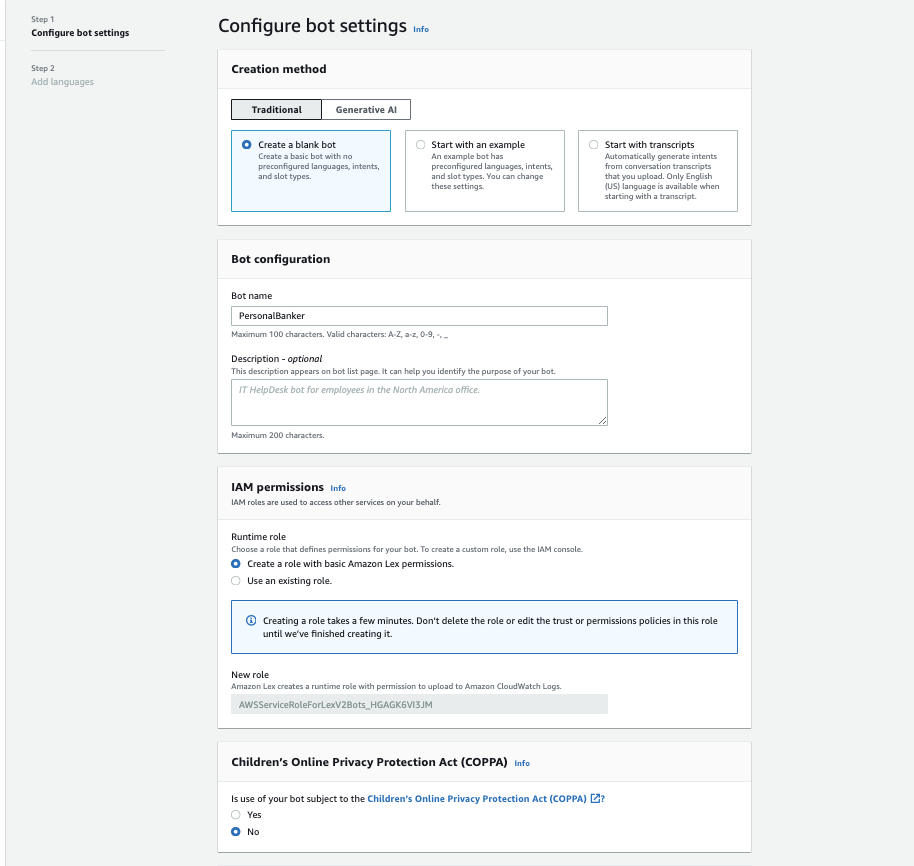

3. Next, we are going to settings language for our bot
- Select your preferred language
- Choose your preferred output voice (You can test voice sample by clicking &quot;Play&quot; button)
- Click &quot;Done&quot;to create a draft version

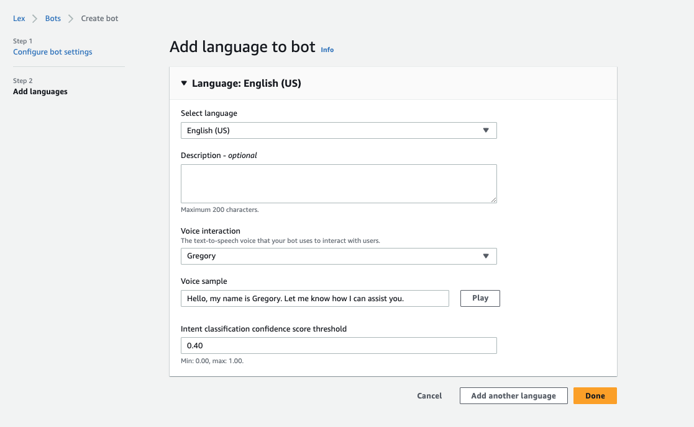

4. We will start by creating an **intent**, which represents an action that the user wants to perform. For example, Our first intent enables the user to get account details, so name this intent &quot;GetBalanceCheck&quot; 
5. We now want to provide samples of what our user would type or say to perform this action (i.e. to activate this intent). Under &quot;Sample utterances&quot;, type the below phrases and hit [enter] or click &quot;Add utterance&quot; button after each phrase. Make sure you do not add a question mark at the end of the phrase as this will cause build issues later on.
- _Check my bank balance_
- _How much money is in my account_
- _How much money do i have_
- _I want to check my balance_

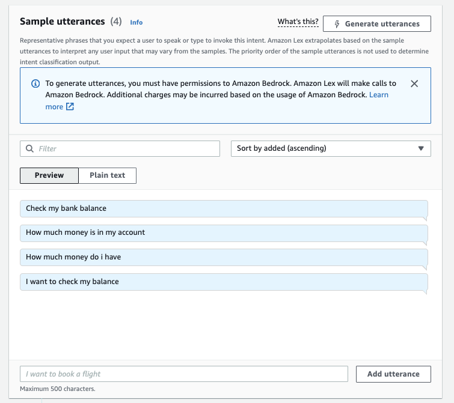

6. Next we define a **slot** which is information we need to process the users request. This information can be included in the utterance (query) that the user types or says, and if not included, Lex will prompt the user for the information. In this case where we build a banker chatbot, the slots would be account type and pin number.

- Under Slots section click &quot;Add slot&quot; button
- For &#39;name&#39; enter &quot;AccountType&quot; 
- Specify &quot;What type of account do you want to check (Current or Savings)?&quot; for the &quot;Prompt&quot; field. This prompt will be used by our bot if the user does not specify an account type when asking a question.
- You can leave  &quot;Slot type&quot; blank for a moment and then click &quot;Add&quot;

7. Click &quot;Save Intent&quot; for temporarily change

8. Under new slot that you just has been created, choose &quot;Advance options&quot;

9. While Lex includes many built-in slot types (such as number, colour, city, food, etc), in this case we want to define a custom slot to get the account type that the user is referring to.

- Select the &quot;Create slot type&quot;, 
- For &quot;Slot type name&quot; enter &quot;AccountType&quot; 
- Click &quot;Add&quot;
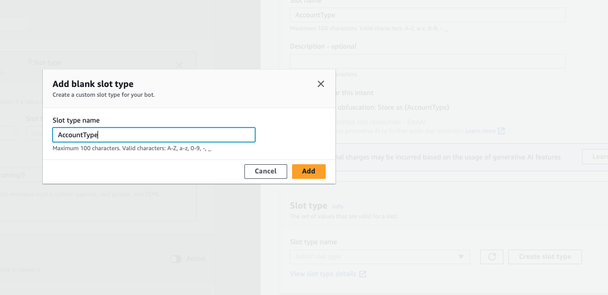

10. For Value, we want to allow the user to make queries against either their &quot;Saving&quot; or &quot;Current&quot; account. So:
- For Slot value resolution, select &quot;restrict to slot values&quot;
- Enter &quot;savings&quot; and &quot;current&quot; as values and click &quot;Add value&quot;
- Click &quot;Save Slot type&quot;

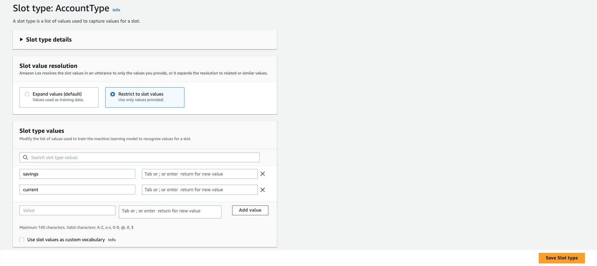

<!-- TODO -->
11. We now have to link the slot types to the Intent so go back to GetBalanceCheck intent. In the existing Slot list change the &quot;Slot type&quot; to &quot;AccountType&quot; so that it matches the slot name that we specified when we created the sample utterences.

12. We are now going to ask a security follow up question and ask the user to enter their four digit pin number.
- Add another slot and add the name as &quot;PinNumber&quot;.
- Select the slot type AMAZON.NUMBER and add the prompt as &quot;What is your pin number for your {AccountType} account&quot;. 
- Ensure you click on the Add button to add your new slot.

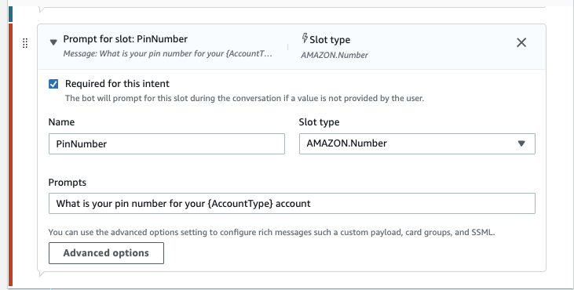

It is worth noting as you build other intents you can modify the order of the Slot collection (ie what questions get asked in which order) and also whether or not the slot is "Required" before passing the values to our external function.

13.  Scroll down and click &quot;Save Intent&quot;

14. Let&#39;s build this simple Bot: Hit the grey Build button at the top right corner. 

The build process takes approximately a minute. Once complete, you can ask your bot a question as a way to test it. For example, you could type &quot;what is my balance
?&quot; in the chat window, or click the microphone symbol, speak your request and client it again to have Lex translate your speech to text. At this stage since we have not added in the backend Lambda function, the response will be that the bot is ready for fulfillment and will show you the values which will be transferred.

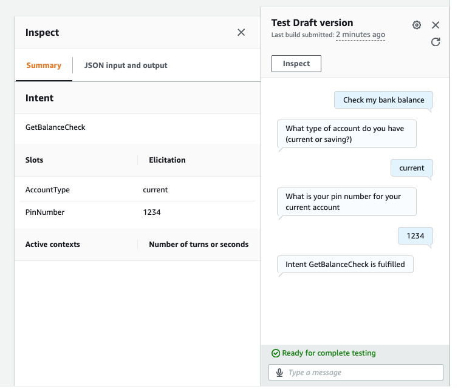.

14. It is possible to give the user a simpler interface on the bot to multiple choice questions using Response Cards. 
- Choose &quot;Advanced options&quot; of AccountType slot. 
- Click button &quot;More prompt options&quot; under Slot prompt section. 
- Under slot prompts click &quot;Add&quot; button form top right and select Add card group
- Provide button info like below and click &quot;Update prompts&quot;

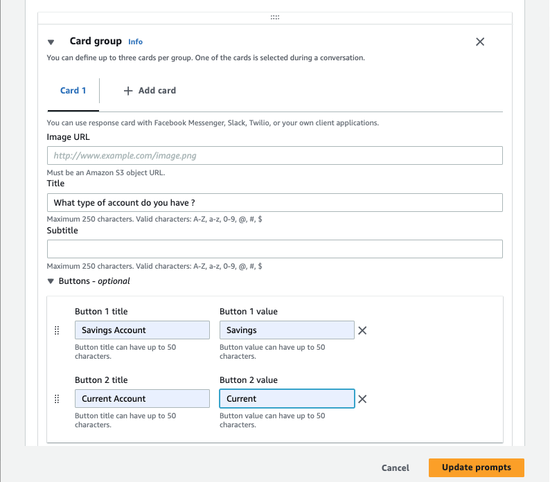.

15. Rebuild the bot and test result should be like this

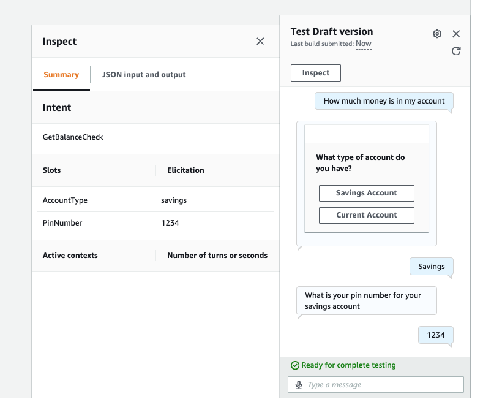.

# Step 2: Fulfilling the bot

We are now in a position that we can transfer the answers to the 'slots' over to a function to perform logic and get a result for the user.

Here we will create a Lambda function that has some Javascript code to detect the intent name (&#39;GetBalanceCheck&#39; and return values based on the AccountType and if the Pin number was entered correctly.

In the Lambda function we have hard-coded an Array of data but in a real world example we would have authenticated the user and would use a database lookup for the account balances.

1. Use the AWS Console to navigate to Lambda.
2. Click on the orange &#39;Create function&#39; link under the &#39;Getting Started&#39; section
- Click the &quot;Author from scratch&quot; button
- Let&#39;s give our function the name of &quot;myPersonalBanker&quot; and optionally provide a description
- Choose Node.js 20.x as the Runtime
- We will &quot;Create new role from AWS policy template – give it a Lex-style role name (such as &quot;LexRole&quot;) and select &quot;Test Harness permissions&quot; as the policy template.
- Hit &quot;Create function&quot; on the bottom right and you&#39;ll be take to the Function detail page.  

3. We are not adding any additional triggers, nor are we using Lambda Layers, so scroll down to the &quot; Code&quot; section
4. Open the lambda function code you will find [here](./personalBanker.mjs) (personalBanker.mjs). Copy and paste the code into the inline editor – make sure that you overwrite any template code that is already in the code box
5. Move to the &#39;&quot;Configuration tab&quot; in the Execution role section and ensure that the role you created previously is selected – if not then please select it
6. Leave the rest unchanged, Back to the code tab and then be sure you hit the &quot;Deploy&quot; button in the code editor screen

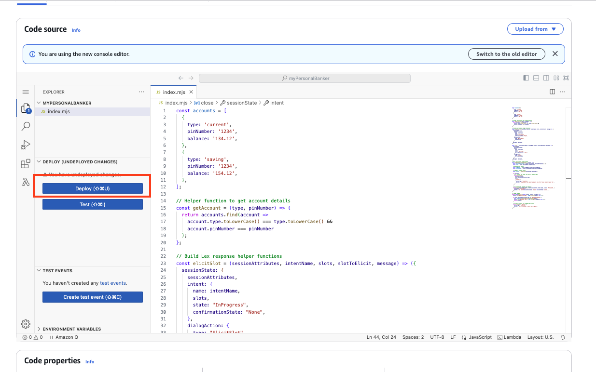

# Step 3: Link the bot with the Lambda function

In this step we will link the intents we created to the Lambda function. We do this by providing the Lambda function as the method that contains the business logic used to &#39;fulfill&#39; the users requests. Once this is done (and the bot rebuilt), when a user specifies an intent (such as &#39;what is my checking account balance&#39;), Lex will call our Lambda function and pass it the intent name (&#39;GetAccountDetail&#39;) and the slot value (&#39;checking&#39;).

To do this, we go back to the [Lex Console](https://console.aws.amazon.com/lex).

1. Click on Personal Banker
2. In the side bar choose Development → Aliases
3. Click on TestBotAlias
4. Under the Language section. Select the language that you choose before
5. Source going to be myPersonalBanker and &quot;$LATEST&quot; as Lambda function version or alias

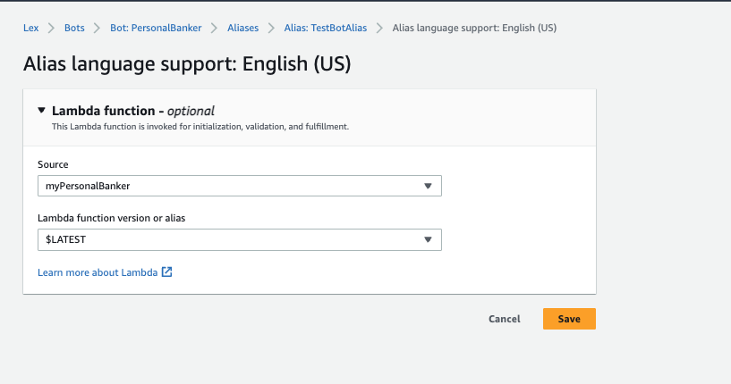

6. Now go back to GetBalanceCheckIntent. Scroll down to &quot;Fulfillment&quot;, click &quot;Advanced options&quot;
7. in Fulfillment Lambda code hook section. check &quot;Use a Lambda function for fulfillment&quot;. It indicates you are giving Lex the permission to run this Lambda function.

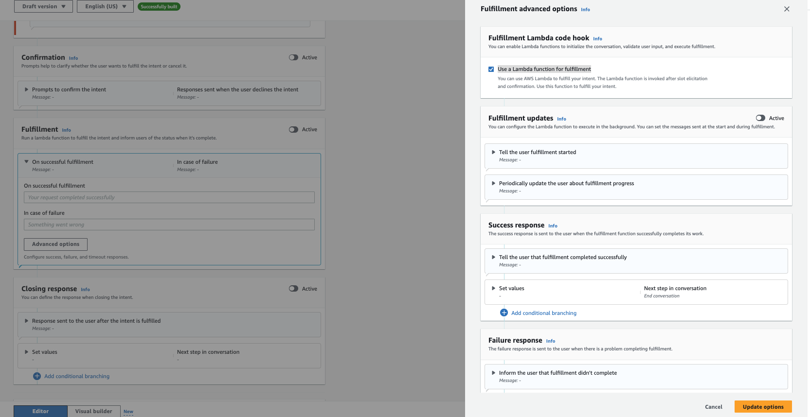

8. Click  &quot;Update options&quot; and be sure to &quot;Save intent&quot
9. Click &quot;Build&quot; again on the confirmation screen.

# Step 4: Running and debugging the bot

1. If you now test the bot as you did at the bottom of [Step 1](#testingthebot) you will see a sample response back from the lambda function. This function has been setup to show you how a very basic flow can be configured and over the next few steps we will modify the code to make the function more helpful.

2. First off all try by choosing 'Saving' and saying the 'PinNumber' is 1234. You should now get a nice response from lex telling you of your account balance. 

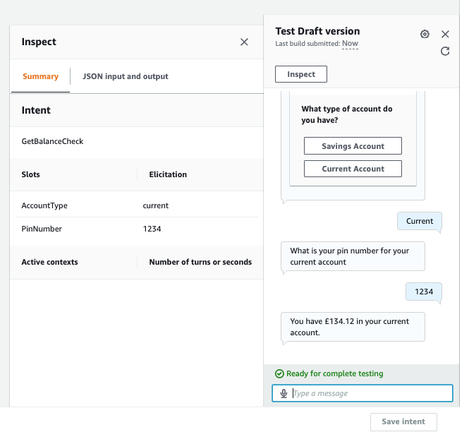

3. Finally we are going to test some error handling and a feedback loop to the user until a correct PinNumber is entered. The code will check to see if there is an account match and if not will request the user tries again and resets the 'Slot'.

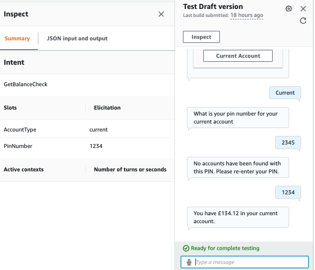
# Conclusion

In this lab you have learned the basic operations to manage a Lex bot. First, you created a bot, then you defined intents and slot types. Finally you defined a Lambda function and attached it to your chatbot.

**NOTE We will be continuing on from this Lab in [The Second Lab](https://github.com/quanganh125/chatbox_with_aws_lex/blob/master/callCenters/README.md) so please do not delete the Lex Bot you have created in this exercise.**
