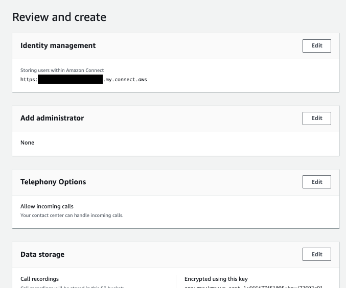

**Last Updated:** Nov 2024

# Building a Call Center with Amazon Connect

## Overview

Amazon Connect is a cloud-based contact center solution which makes it easy to set up and manage a customer contact center and provide reliable customer engagement at any scale. You can deploy a contact center in just a few steps, onboard agents from anywhere, and begin to engage with your customers. 

- Creating a Call Center
- Create a simple contact flow
- Adding a Lex Bot to your flow
- Improving your Call Flows
- Extra: Getting personal with your caller

# Step 1: Setting Up A Call Center

1.  Log in to the [AWS console](https://console.aws.amazon.com/connect/home?region=us-east-1#) and navigate to the Amazon Connect service
2. **Please ensure you have selected North Virginia as the region in the top right (Amazon Connect is not available in all regions yet)**
3. If you have never created a Call Center, click &quot;Add an instance&quot;
4. At very first Set identity step. Select "Identity management" then enter a custom Access URL (This is a unique name so you will might need to be creative) then click 'Next'
5. Next we will add administrator. This step is optional so you can choose "No administrator" or specify an administrator if you want. Then click 'Next'
6. For this lab you will not need to make outgoing calls, uncheck this option and click 'Next'
7. Data storage step: The Connect application will automatically create you a S3 bucket and encrypt the data. Click 'Next'
8. Finally review the information again click 'Create Instance'. 

11. This may take a minute or two to setup.
12. Once it is setup you will be presented with a screen which allows you to 'Get Started'
13. Your browser will pop up a warning to ask you show notifications - this is to allow the Connect Application to notify you when a call is coming in. Click allow on the pop up.

14. At this point your Call Center is setup but you don't have any numbers so you need to 'Claim your first number' - For this lab chose a **UK Direct Dial Number** and click 'Next'.
15.  This is the first number for your call center - you now can call the number and go through the default first call example that is part of Amazon Connect by ringing the number that is allocated to you or click 'Skip for now'.
